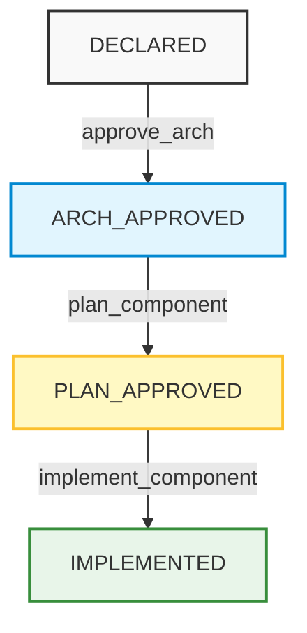

# Antigravity Architecture Registry

NOTE: THIS IS AN EARLY PROTOTYPE, A FEW UNFINISED/NOT FULLY WIRED THINGS AND AGENT/SKILL DIRECTION NEED A BIT OF TUNING, (Right now you might have to remind it to stick to workflows every once in a while), that being said it works pretty well already!

The Antigravity Architecture Registry is a strictly-typed, unified registry plugin designed to model, manage, and validate software component interfaces and call/dependency trees. By defining system interfaces, side-effects, and internal contracts up-front, the registry prevents design-to-implementation drift and coordinates developer agents across the lifecycle of a codebase.

It defines an programatically driven process for the agent:
- Intial Planning
    - Capture existing touch points in code where new functiontly will integrate
    - Capture new/ update functionlity as structured components with explicit:
        - Schemas/api
        - Specs for algos, logic or other details
        - Invariants for non negotiables for the implmention
        - Validatiors to check correcteness/ compleness
    - Capture use sites tree for components
    - Compiler "style" validation with schema/ type checks
    - Merkle Tree invalidation propages to sub components on changes
- Implementation Planning
  - Component implmention is planned one at a time, bottom - up, in topolocial order
  - Using subagent for very focused context, and parallel execution where possible
- Implementation
  - Component implmention bottom - up, in topolocial order
      - Parent comps. have access to the fully implmented building blocks they depnd on
  - Using subagent for very focused context, and parallel execution where possible
  - Implemention subagents use componenet programmatic valiations to assess "DONE" 

---

## 1. Installation & Global Setup

The Architecture Registry is fully compatible with both **Opencode** (as a global plugin with custom subagents and skills) and **Antigravity 2.0 (AG2.0)**. 

### A. Global Setup for opencode

To configure the custom skills, model-agnostic agent prompts, and the local MCP server globally, use the standard, pure-Python CLI installer:

#### Step 1: Install the package globally via Git/GitHub
Using your preferred Python package tool (`uv` or `pipx`):
```bash
uv tool install git+https://github.com/izo0x90/antigravity-architecture-registry.git
```

#### Step 2: Run the automated setup
This command programmatically copies the shared skills and agents to `~/.config/opencode/` and registers the global MCP server inside `opencode.json`:
```bash
architecture-registry setup
```

That's it! When you boot up `opencode`, the skills and agents will be auto-discovered and active in any session.

---

### B. Global Setup for Antigravity 2.0 (AG2.0)

For AG2.0, the extension and agent JSON/Markdown definitions are located under `gemini-extension.json` and `agents/` at the repository root.

#### Step 1: Clone the repository
```bash
git clone https://github.com/izo0x90/antigravity-architecture-registry.git
cd antigravity-architecture-registry
```

#### Step 2: Load the Extension
Point your AG2.0 runtime to the `gemini-extension.json` at the root of the cloned directory. The extension is configured to execute our console script natively using the standard `uv run --project` workspace flag.

---

## 2. Phase-Based Workflow & Usage

The development cycle is organized into three distinct, gate-protected phases. Developers interact with the main agent in a collaborative chat interface to drive components through this lifecycle.


```mermaid
graph TD
    A[DECLARED] -->|approve_arch| B[ARCH_APPROVED]
    B -->|plan_component| C[PLAN_APPROVED]
    C -->|implement_component| D[IMPLEMENTED]
    
    style A fill:#f9f9f9,stroke:#333,stroke-width:2px
    style B fill:#e1f5fe,stroke:#0288d1,stroke-width:2px
    style C fill:#fff9c4,stroke:#fbc02d,stroke-width:2px
    style D fill:#e8f5e9,stroke:#388e3c,stroke-width:2px
```

### Phase 1: Architectural Design
* **Interactive Discovery**: Chat back and forth with the main agent to analyze existing files, explore design options, and discover architectural patterns in the codebase.
* **Interface Registry**: Instruct the main agent to capture the architecture and its corresponding pieces as they are discussed or read. The user does not interact with the registry tools directly; the main agent calls the appropriate tools (like `add_component` and `add_usage_node`) to build out the `DECLARED` nodes on your behalf.
* **Summary and Verification**: Request summaries of what is currently captured in the architecture registry. The agent uses `visualize_architecture` and `check_compatibility` to verify interface and dependency alignment.
* **Gate Approval**: Once satisfied with the static design, instruct the main agent to approve the architecture (e.g., "approve the architecture for user_repository"). The agent runs final verification checks and invokes `approve_arch` to promote the components to the `ARCH_APPROVED` stage.

### Phase 2: Work Planning
* **Task Generation**: Once a component is `ARCH_APPROVED`, the agent or specialized subagent (`ComponentPlanner`) analyzes the component's abstract implementation specifications and breaks them down into a concrete list of itemized development tasks (`modification_tasks`).
* **Interactive Task Review**: Ask the main agent for a summary of the planned tasks. Iterate on the plan by requesting specific changes, updates, or additions to the tasks if needed.
* **Gate Approval**: Once you are satisfied with the implementation plan, instruct the agent to move to the implementation stage. The agent runs topological sequence checks and calls `plan_component` to promote the component to the `PLAN_APPROVED` stage.

### Phase 3: Physical Implementation
* **Agent Execution**: The sandboxed subagent (`ComponentImplementer`) is spawned to write the source code. It reads the authoritative compiled contract using `compile_component_contract`, writes tests first (Test-Driven Development), and updates the tasks in the registry as completed.
* **Testing & Verification**: The implementer executes the project's verification suites (e.g., `pytest`, `mypy`, `ruff`) and registers the completion logs. Once all tests and tasks pass, the component is promoted to `IMPLEMENTED` via `implement_component`.
* **Completion Summary & Review**: The parent orchestrator provides a concise completion summary. Review the actual physical code modifications in detail using the `/diff` command or standard `git diff`.

---

## 3. Further Technical Details

This section outlines the internal mechanics, tools, data schemas, and programmatic validations that govern the registry.

### Core MCP Server Tools
The main coordinator agent manages the system using a set of first-class Model Context Protocol (MCP) server tools:
* `add_component` / `update_component`: Manages flat component definitions.
* `add_usage_node` / `update_usage_node`: Manages caller-to-target dependency trees.
* `check_compatibility`: Scans the usage trees to verify contract alignment and detect errors.
* `visualize_architecture`: Renders dependency trees as ASCII hierarchies or color-coded Mermaid flowcharts.
* `compile_component_contract`: Aggregates and compiles a complete, stateful contract for a target component, recursively resolving and inlining schemas and invariants.

### Registry Data Structures
All data is persisted in a flat, purely relational schema within `system_architecture.json`. 

#### 1. Component Node Schema
Every software element (module, class, method, data object) is registered as a flat component node:
* `id` (string): Unique identifier.
* `type` (string): Seeded as `module`, `class`, `interface`, `function`, `operation`, `data_object`, or `enum`.
* `parent_id` (string, optional): Parent pointer establishing parent-child hierarchies (e.g., method parented to a class) dynamically.
* `implements_id` (string, optional): Implemented interface pointer, allowing signature and contract inheritance.
* `properties_dsl` / `inputs_dsl` / `outputs_dsl` (string, optional): Formatted key-value parameters parsed using a flat shorthand DSL (e.g. `userId: int, email: str?`).
* `side_effects_csv` (string, optional): Comma-separated list of side-effect tags and descriptions (e.g., `db:Reads user table`).
* `status` (string): State tracker (`new`, `existing`, `modifying`, `deprecated`).
* `stage` (string): Stateful lifecycle stage (`DECLARED`, `ARCH_APPROVED`, `PLAN_APPROVED`, `IMPLEMENTED`).

#### 2. Usage Node Schema
Call-site nodes map client expectations to registered target components:
* `node_id` (string): Unique call-site identifier.
* `caller_id` (string): Calling component identifier.
* `component_id` (string): Called target component identifier.
* `expected_inputs_dsl` / `expected_outputs_dsl` (string): Expected parameters defined in shorthand flat DSL.
* `expected_side_effects_csv` (string): Side-effects expected at the call-site.

### Programmatic Validation Engine
When executing `check_compatibility` or transitioning between stages, the registry's internal validation engine performs several strict checks:
1. **Shorthand DSL Compilation**: Translates shorthand DSL strings into standard JSON Schema structures, recursively resolving custom referenced object types (like DTOs or enums).
2. **Interface Compatibility**: Validates that a caller's expectations (`expected_inputs_dsl` / `expected_outputs_dsl`) are structurally compatible with the target's registered interfaces.
3. **Side-Effect Tag Compliance**: Verifies that any side-effect tags declared at a call-site are fully permitted and handled by the target component's contract.
4. **Sequence & Invariant Checks**: For implementation specs, verifies that sequential logic steps start at `1` and are contiguous. Also ensures that inherited invariants preserve their designated types (`pre_condition`, `post_condition`, `system_invariant`).
5. **Topological Dependency Ordering**: Prevents a component from being planned or implemented unless all of its upstream or inherited dependencies have already reached the required stages in the lifecycle.
